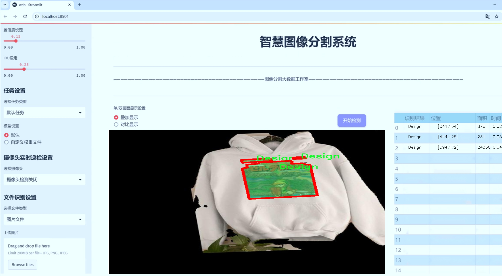
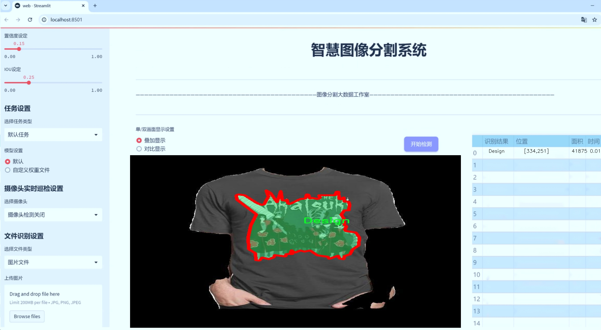
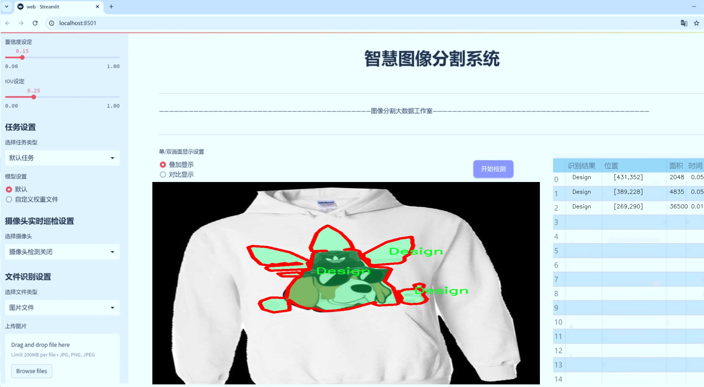
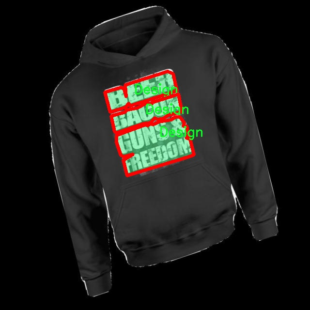
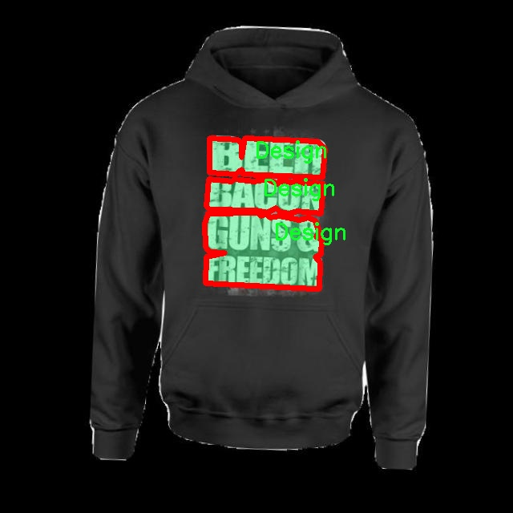
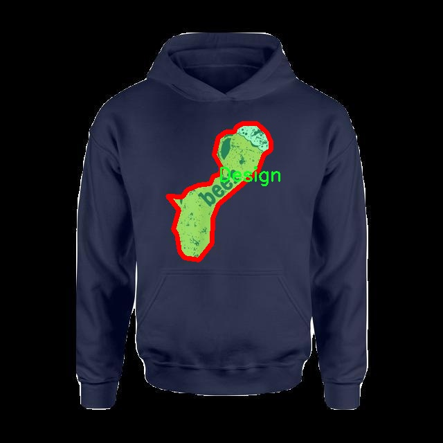
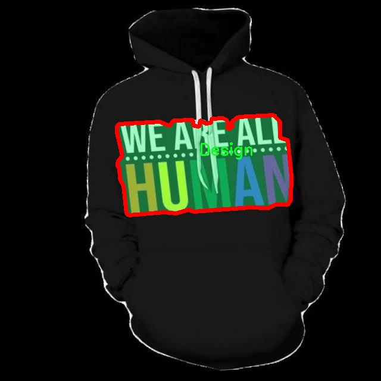

# 服装图案花纹设计元素图像分割系统： yolov8-seg-AIFI

### 1.研究背景与意义

[参考博客](https://gitee.com/YOLOv8_YOLOv11_Segmentation_Studio/projects)

[博客来源](https://kdocs.cn/l/cszuIiCKVNis)

研究背景与意义

随着时尚产业的快速发展，服装设计的多样性和个性化需求日益增强。服装图案花纹作为服装设计的重要组成部分，不仅影响着消费者的购买决策，还在一定程度上反映了文化、艺术和社会趋势。因此，如何高效、准确地提取和分析服装图案花纹设计元素，成为了时尚设计领域亟待解决的问题。传统的图案设计分析方法往往依赖于人工识别和手工处理，效率低下且容易受到主观因素的影响，难以满足现代设计的高效性和精确性要求。

近年来，计算机视觉技术的迅猛发展为图像处理提供了新的解决方案。尤其是深度学习技术的应用，使得图像分割任务得到了显著提升。YOLO（You Only Look Once）系列模型因其高效的实时目标检测能力，逐渐成为图像分割领域的重要工具。YOLOv8作为该系列的最新版本，结合了多种先进的深度学习技术，具备了更强的特征提取能力和更高的分割精度。然而，针对服装图案花纹设计元素的特定需求，YOLOv8的标准模型仍然存在一定的局限性。因此，基于改进YOLOv8的服装图案花纹设计元素图像分割系统的研究，具有重要的理论和实践意义。

本研究将利用一个包含2100张图像的专用数据集，聚焦于服装设计元素的实例分割。该数据集涵盖了多种服装图案花纹，能够为模型的训练和测试提供丰富的样本。这一数据集的建立，不仅为后续的研究提供了基础数据支持，也为服装设计师和研究人员提供了宝贵的参考资料。通过对该数据集的深入分析和处理，能够有效提升模型在特定领域的适应性和准确性，从而推动服装设计的智能化进程。

此外，改进YOLOv8模型的研究将有助于提升图像分割技术在服装设计中的应用价值。通过优化模型结构和算法，增强其对复杂图案的识别能力，可以实现对服装图案花纹的精准分割。这不仅能够提高设计师的工作效率，还能够为服装生产提供数据支持，推动个性化定制和智能制造的发展。随着人工智能技术的不断进步，未来的服装设计将更加依赖于数据驱动的决策，这一研究将为相关领域的学术研究和产业应用提供新的思路和方法。

综上所述，基于改进YOLOv8的服装图案花纹设计元素图像分割系统的研究，不仅具有重要的学术价值，也为时尚产业的数字化转型提供了新的技术路径。通过实现高效、准确的图案分割，将为服装设计的创新和发展注入新的活力，推动整个行业向更高水平迈进。

### 2.图片演示







注意：本项目提供完整的训练源码数据集和训练教程,由于此博客编辑较早,暂不提供权重文件（best.pt）,需要按照6.训练教程进行训练后实现上图效果。

### 3.视频演示

[3.1 视频演示](https://www.bilibili.com/video/BV1pKmmYwEQX/)

### 4.数据集信息

##### 4.1 数据集类别数＆类别名

nc: 1
names: ['Design']


##### 4.2 数据集信息简介

数据集信息展示

在本研究中，我们使用了名为“Design segment”的数据集，以支持改进YOLOv8-seg的服装图案花纹设计元素图像分割系统的训练与测试。该数据集专注于服装设计领域，旨在为图像分割任务提供高质量的样本数据，帮助模型更准确地识别和分离服装图案中的设计元素。数据集的类别数量为1，具体类别为“Design”，这意味着所有的图像均围绕这一主题展开，涵盖了多种风格和形式的设计元素。

“Design segment”数据集包含了大量的图像样本，这些样本经过精心挑选和标注，确保了其在训练过程中的有效性和可靠性。每张图像都展现了不同的服装设计，包含丰富的色彩、纹理和形状，能够有效地反映出当代服装设计的多样性与复杂性。通过对这些图像的分割，模型能够学习到如何识别出设计元素的边界，从而实现精准的图像分割。

数据集的构建过程注重了图像的多样性和代表性，确保涵盖了不同类型的服装设计，包括但不限于休闲装、正式服装、运动服以及时尚配饰等。这种多样性不仅提高了模型的泛化能力，还使其能够适应不同风格的设计需求。在数据集的标注过程中，采用了专业的标注工具和技术，确保每个设计元素的边界清晰可见，从而为模型的训练提供了高质量的标签数据。

此外，数据集还考虑到了图像的分辨率和质量，所有图像均为高分辨率格式，确保在进行图像分割时，细节部分不会丢失。这对于服装设计元素的精确识别至关重要，因为许多设计细节可能在低分辨率图像中变得模糊不清。通过使用高质量的图像，模型能够更好地捕捉到设计元素的细微差别，从而提升分割的准确性。

在训练过程中，YOLOv8-seg模型将利用“Design segment”数据集进行反复迭代，逐步优化其参数和结构，以实现更高效的图像分割。通过对大量样本的学习，模型将能够自动识别出服装设计中的关键元素，并进行准确的分割。这一过程不仅提高了模型的性能，也为后续的服装设计和生产提供了有力的技术支持。

总之，“Design segment”数据集为改进YOLOv8-seg的服装图案花纹设计元素图像分割系统提供了坚实的基础。通过对这一数据集的深入分析和应用，我们期望能够推动服装设计领域的技术进步，助力设计师在创作过程中更加高效地实现他们的创意与构思。随着研究的深入，数据集的价值将愈加凸显，为服装设计的智能化和自动化发展开辟新的可能性。










### 5.项目依赖环境部署教程（零基础手把手教学）

[5.1 环境部署教程链接（零基础手把手教学）](https://www.bilibili.com/video/BV1jG4Ve4E9t/?vd_source=bc9aec86d164b67a7004b996143742dc)


[5.2 安装Python虚拟环境创建和依赖库安装视频教程链接（零基础手把手教学）](https://www.bilibili.com/video/BV1nA4VeYEze/?vd_source=bc9aec86d164b67a7004b996143742dc)

### 6.手把手YOLOV8-seg训练视频教程（零基础手把手教学）

[6.1 手把手YOLOV8-seg训练视频教程（零基础小白有手就能学会）](https://www.bilibili.com/video/BV1cA4VeYETe/?vd_source=bc9aec86d164b67a7004b996143742dc)


按照上面的训练视频教程链接加载项目提供的数据集，运行train.py即可开始训练



     Epoch   gpu_mem       box       obj       cls    labels  img_size
     1/200     0G   0.01576   0.01955  0.007536        22      1280: 100%|██████████| 849/849 [14:42<00:00,  1.04s/it]
               Class     Images     Labels          P          R     mAP@.5 mAP@.5:.95: 100%|██████████| 213/213 [01:14<00:00,  2.87it/s]
                 all       3395      17314      0.994      0.957      0.0957      0.0843

     Epoch   gpu_mem       box       obj       cls    labels  img_size
     2/200     0G   0.01578   0.01923  0.007006        22      1280: 100%|██████████| 849/849 [14:44<00:00,  1.04s/it]
               Class     Images     Labels          P          R     mAP@.5 mAP@.5:.95: 100%|██████████| 213/213 [01:12<00:00,  2.95it/s]
                 all       3395      17314      0.996      0.956      0.0957      0.0845

     Epoch   gpu_mem       box       obj       cls    labels  img_size
     3/200     0G   0.01561    0.0191  0.006895        27      1280: 100%|██████████| 849/849 [10:56<00:00,  1.29it/s]
               Class     Images     Labels          P          R     mAP@.5 mAP@.5:.95: 100%|███████   | 187/213 [00:52<00:00,  4.04it/s]
                 all       3395      17314      0.996      0.957      0.0957      0.0845


### 7.50+种全套YOLOV8-seg创新点加载调参实验视频教程（一键加载写好的改进模型的配置文件）

[7.1 50+种全套YOLOV8-seg创新点加载调参实验视频教程（一键加载写好的改进模型的配置文件）](https://www.bilibili.com/video/BV1Hw4VePEXv/?vd_source=bc9aec86d164b67a7004b996143742dc)

### YOLOV8-seg算法简介

原始YOLOv8-seg算法原理

YOLOv8-seg算法是YOLO系列目标检测模型的最新版本，它在YOLOv5的基础上进行了显著的优化和升级，特别是在处理复杂场景和小目标检测方面。该算法的设计理念是实现高效、精确的目标检测，同时保持模型的轻量化特性，以适应各种实际应用场景。YOLOv8-seg不仅仅是一个目标检测模型，它还扩展了分割功能，使得在图像中对目标进行精确的边界识别成为可能，这对于许多计算机视觉任务来说都是至关重要的。

YOLOv8-seg的网络结构主要由三个核心部分组成：骨干特征提取网络、特征融合层和检测头层。骨干特征提取网络采用了轻量化的C2F模块，这一模块的设计灵感来源于对卷积操作的深度优化。与传统的C3模块相比，C2F模块通过使用3×3的卷积核和更少的参数量来提升特征提取的效率，同时保持了模型的精度。这种轻量化设计使得YOLOv8-seg能够在资源受限的环境中运行，适用于实时检测任务。

在特征融合层，YOLOv8-seg引入了特征金字塔网络（FPN）和路径聚合网络（PAN）的结合，形成了一个强大的特征融合机制。FPN能够有效地提取不同尺度的特征，而PAN则通过上下采样和特征拼接的方式，进一步增强了多尺度特征的表达能力。为了进一步提升模型的性能，YOLOv8-seg还采用了BiFPN网络结构。这一结构的核心思想是通过高效的双向跨尺度连接和加权特征融合，来提高不同尺度特征信息的提取速度和质量。BiFPN通过简化网络结构，删除冗余的节点，优化了特征流动，使得模型在处理复杂场景时能够更好地捕捉到细节信息。

YOLOv8-seg在检测头层的设计上也进行了创新，采用了解耦头结构。这一结构将目标分类和回归过程分开进行，允许模型在处理不同任务时能够更加灵活和高效。通过这种解耦设计，YOLOv8-seg能够更好地处理正负样本的匹配和损失计算，采用了Task-Aligned Assigner方法对分类分数和回归分数进行加权匹配。这种方法的引入，使得模型在训练过程中能够更好地平衡不同任务的损失，提升了整体的检测性能。

在实际应用中，YOLOv8-seg通过一系列的数据增强技术，如Mosaic数据增强、自适应图片缩放和灰度填充等，对输入图像进行预处理。这些预处理步骤不仅能够提升模型的鲁棒性，还能有效地减轻噪声对特征提取的影响。此外，YOLOv8-seg还引入了MPDIoU损失函数，替代了传统的CIoU损失函数，以提高模型的泛化能力和精确度。这一损失函数的设计考虑了目标之间的相对位置和形状，能够更好地适应复杂的检测场景。

YOLOv8-seg的优势不仅体现在其轻量化的网络结构和高效的特征提取能力上，还在于其对小目标的检测能力。传统的目标检测模型在处理小目标时往往存在漏检的问题，而YOLOv8-seg通过引入更小的检测头和改进的特征融合策略，显著提升了对小目标的感知能力。这一特性使得YOLOv8-seg在复杂水面环境等特殊场景下，能够有效地识别和定位小型漂浮物体，解决了以往模型在这些情况下的局限性。

总的来说，YOLOv8-seg算法通过一系列的创新设计和优化，成功地将目标检测与分割功能结合在一起，形成了一个高效、精确且适应性强的计算机视觉解决方案。其轻量化的特性和对小目标的敏感性，使得YOLOv8-seg在实际应用中具有广泛的前景，能够满足各种复杂场景下的需求。随着计算机视觉技术的不断发展，YOLOv8-seg无疑将在未来的研究和应用中发挥重要的作用。


### 9.系统功能展示（检测对象为举例，实际内容以本项目数据集为准）

图9.1.系统支持检测结果表格显示

  图9.2.系统支持置信度和IOU阈值手动调节

  图9.3.系统支持自定义加载权重文件best.pt(需要你通过步骤5中训练获得)

  图9.4.系统支持摄像头实时识别

  图9.5.系统支持图片识别

  图9.6.系统支持视频识别

  图9.7.系统支持识别结果文件自动保存

  图9.8.系统支持Excel导出检测结果数据


### 10.50+种全套YOLOV8-seg创新点原理讲解（非科班也可以轻松写刊发刊，V11版本正在科研待更新）

#### 10.1 由于篇幅限制，每个创新点的具体原理讲解就不一一展开，具体见下列网址中的创新点对应子项目的技术原理博客网址【Blog】：


[10.1 50+种全套YOLOV8-seg创新点原理讲解链接](https://gitee.com/qunmasj/good)

#### 10.2 部分改进模块原理讲解(完整的改进原理见上图和技术博客链接)【如果此小节的图加载失败可以通过CSDN或者Github搜索该博客的标题访问原始博客，原始博客图片显示正常】

### YOLOv8模型
YOLOv8模型由Ultralytics团队在YOLOv5模型的基础上，吸收了近两年半来经过实际验证的各种改进，于2023年1月提出。与之前的一些YOLO 系列模型想类似，YOLOv8模型也有多种尺寸，下面以YOLOv8n为例，分析 YOLOv8模型的结构和改进点。YOLOv8模型网络结构如
输入图片的部分，由于发现Mosaic数据增强尽管这有助于提升模型的鲁棒性和泛化性，但是，在一定程度上，也会破坏数据的真实分布，使得模型学习到一些不好的信息。所以YOLOv8模型在训练中的最后10个epoch 停止使用Mosaic数据增强。


在网络结构上，首先主干网络的改变不大，主要是将C3模块替换为了C2f模块，该模块的结构在上图中已示出。C2f模块在C3模块的思路基础上，引入了YOLOv7中 ELAN的思路，引入了更多的跳层连接，这有助于该模块获得更丰富的梯度流信息，而且模型的轻量化得到了保证。依然保留了SPPF，效果不变的同时减少了该模块的执行时间。
在颈部网络中，也是将所有的C3模块更改为C2f模块，同时删除了两处上采样之前的卷积连接层。
在头部网络中，采用了YOLOX中使用的解耦头的思路，两条并行的分支分别提取类别和位置特征。由于分类任务更注重于分析特征图中提取到的特征与已输入图片的部分，由于发现 Mosaic数据增强尽管这有助于提升模型的鲁棒性和泛化性，但是，在一定程度上，也会破坏数据的真实分布，使得模型学习到一些不好的信息。所以YOLOv8模型在训练中的最后10个epoch停止使用Mosaic数据增强。
在网络结构上，首先主干网络的改变不大，主要是将C3模块替换为了C2f模块，该模块的结构在上图中已示出。C2f模块在C3模块的思路基础上，引入了YOLOv7中ELAN的思路，引入了更多的跳层连接，这有助于该模块获得更丰富的梯度流信息，而且模型的轻量化得到了保证。依然保留了SPPF，效果不变的同时减少了该模块的执行时间。
在颈部网络中，也是将所有的C3模块更改为C2f模块，同时删除了两处上采样之前的卷积连接层。
在头部网络中，采用了YOLOX中使用的解耦头的思路，两条并行的分支分别提取类别和位置特征。由于分类任务更注重于分析特征图中提取到的特征与已有类别中的哪一种更为相似，而定位任务更关注边界框与真值框的位置关系，并据此对边界框的坐标进行调整。侧重点的不同使得在使用两个检测头时收敛的速度和预测的精度有所提高。而且使用了无锚框结构，直接预测目标的中心，并使用TAL (Task Alignment Learning，任务对齐学习）来区分正负样本，引入了分类分数和IOU的高次幂乘积作为衡量任务对齐程度的指标，认为同时拥有好的定位和分类评价的在分类和定位损失函数中也引入了这项指标。
在模型的检测结果上，YOLOv8模型也取得了较好的成果，图为官方在coCO数据集上 YOLOv8模型的模型尺寸大小和检测的mAP50-95对比图。mAP50-95指的是IOU的值从50%取到95%，步长为5%，然后算在这些IOU下的mAP的均值。图的 a）图展示了YOLOv8在同尺寸下模型中参数没有较大增加的前提下取得了比其他模型更好的精度，图2-17的b)图展示了YOLOv8比其他YOLO系列模型在同尺寸时，推理速度更快且精度没有太大下降。


### 视觉transformer(ViT)简介
视觉transformer(ViT)最近在各种计算机视觉任务中证明了巨大的成功，并受到了相当多的关注。与卷积神经网络(CNNs)相比，ViT具有更强的全局信息捕获能力和远程交互能力，表现出优于CNNs的准确性，特别是在扩大训练数据大小和模型大小时[An image is worth 16x16 words: Transformers for image recognition at scale,Coatnet]。

尽管ViT在低分辨率和高计算领域取得了巨大成功，但在高分辨率和低计算场景下，ViT仍不如cnn。例如，下图(左)比较了COCO数据集上当前基于cnn和基于vit的一级检测器。基于vit的检测器(160G mac)和基于cnn的检测器(6G mac)之间的效率差距超过一个数量级。这阻碍了在边缘设备的实时高分辨率视觉应用程序上部署ViT。


左图:现有的基于vit的一级检测器在实时目标检测方面仍然不如当前基于cnn的一级检测器，需要的计算量多出一个数量级。本文引入了第一个基于vit的实时对象检测器来弥补这一差距。在COCO上，efficientvit的AP比efficientdet高3.8，而mac较低。与YoloX相比，efficient ViT节省67.2%的计算成本，同时提供更高的AP。

中:随着输入分辨率的增加，计算成本呈二次增长，无法有效处理高分辨率的视觉应用。

右图:高分辨率对图像分割很重要。当输入分辨率从1024x2048降低到512x1024时，MobileNetV2的mIoU减少12% (8.5 mIoU)。在不提高分辨率的情况下，只提高模型尺寸是无法缩小性能差距的。

ViT的根本计算瓶颈是softmax注意模块，其计算成本随输入分辨率的增加呈二次增长。例如，如上图(中)所示，随着输入分辨率的增加，vit- small[Pytorch image models. https://github.com/rwightman/ pytorch-image-models]的计算成本迅速显著大于ResNet-152的计算成本。

解决这个问题的一个直接方法是降低输入分辨率。然而，高分辨率的视觉识别在许多现实世界的计算机视觉应用中是必不可少的，如自动驾驶，医疗图像处理等。当输入分辨率降低时，图像中的小物体和精细细节会消失，导致目标检测和语义分割性能显著下降。

上图(右)显示了在cityscape数据集上不同输入分辨率和宽度乘法器下MobileNetV2的性能。例如，将输入分辨率从1024x2048降低到512x1024会使cityscape的性能降低12% (8.5 mIoU)。即使是3.6倍高的mac，只放大模型尺寸而不增加分辨率也无法弥补这一性能损失。

除了降低分辨率外，另一种代表性的方法是限制softmax注意，方法是将其范围限制在固定大小的局部窗口内[Swin transformer,Swin transformer v2]或降低键/值张量的维数[Pyramid vision transformer,Segformer]。然而，它损害了ViT的非局部注意能力，降低了全局接受域(ViT最重要的优点)，使得ViT与大内核cnn的区别更小[A convnet for the 2020s,Scaling up your kernels to 31x31: Revisiting large kernel design in cnns,Lite pose: Efficient architecture design for 2d human pose estimation]。

本文介绍了一个有效的ViT体系结构，以解决这些挑战。发现没有必要坚持softmax注意力。本文建议用线性注意[Transformers are rnns: Fast autoregressive transformers with linear attention]代替softmax注意。

线性注意的关键好处是，它保持了完整的n 2 n^2n 2
 注意映射，就像softmax注意。同时，它利用矩阵乘法的联想特性，避免显式计算完整的注意映射，同时保持相同的功能。因此，它保持了softmax注意力的全局特征提取能力，且计算复杂度仅为线性。线性注意的另一个关键优点是它避免了softmax，这使得它在移动设备上更有效(下图左)。


左图:线性注意比类似mac下的softmax注意快3.3-4.5倍，这是因为去掉了硬件效率不高的softmax功能。延迟是在Qualcomm Snapdragon 855 CPU和TensorFlow-Lite上测量的。本文增加线性注意的头部数量，以确保它具有与softmax注意相似的mac。

中:然而，如果没有softmax注意中使用的非线性注意评分归一化，线性注意无法有效集中其注意分布，削弱了其局部特征提取能力。后文提供了可视化。

右图:本文用深度卷积增强线性注意，以解决线性注意的局限性。深度卷积可以有效地捕捉局部特征，而线性注意可以专注于捕捉全局信息。增强的线性注意在保持线性注意的效率和简单性的同时，表现出在各种视觉任务上的强大表现(图4)。

然而，直接应用线性注意也有缺点。以往的研究表明线性注意和softmax注意之间存在显著的性能差距(下图中间)。


左:高通骁龙855上的精度和延迟权衡。效率vit比效率网快3倍，精度更高。中:ImageNet上softmax注意与线性注意的比较。在相同的计算条件下，本文观察到softmax注意与线性注意之间存在显著的精度差距。而深度卷积增强模型后，线性注意的精度有明显提高。

相比之下，softmax注意的精度变化不大。在相同MAC约束下，增强线性注意比增强软最大注意提高了0.3%的精度。右图:与增强的softmax注意相比，增强的线性注意硬件效率更高，随着分辨率的增加，延迟增长更慢。

深入研究线性注意和softmax注意的详细公式，一个关键的区别是线性注意缺乏非线性注意评分归一化方案。这使得线性注意无法有效地将注意力分布集中在局部模式产生的高注意分数上，从而削弱了其局部特征提取能力。

本文认为这是线性注意的主要限制，使其性能不如softmax注意。本文提出了一个简单而有效的解决方案来解决这一限制，同时保持线性注意在低复杂度和低硬件延迟方面的优势。具体来说，本文建议通过在每个FFN层中插入额外的深度卷积来增强线性注意。因此，本文不需要依赖线性注意进行局部特征提取，避免了线性注意在捕捉局部特征方面的不足，并利用了线性注意在捕捉全局特征方面的优势。

本文广泛评估了efficient vit在低计算预算下对各种视觉任务的有效性，包括COCO对象检测、城市景观语义分割和ImageNet分类。本文想要突出高效的主干设计，所以没有包括任何正交的附加技术(例如，知识蒸馏，神经架构搜索)。尽管如此，在COCO val2017上，efficientvit的AP比efficientdet - d1高2.4倍，同时节省27.9%的计算成本。在cityscape上，efficientvit提供了比SegFormer高2.5个mIoU，同时降低了69.6%的计算成本。在ImageNet上，efficientvit在584M mac上实现了79.7%的top1精度，优于efficientnet - b1的精度，同时节省了16.6%的计算成本。

与现有的以减少参数大小或mac为目标的移动ViT模型[Mobile-former,Mobilevit,NASVit]不同，本文的目标是减少移动设备上的延迟。本文的模型不涉及复杂的依赖或硬件低效操作。因此，本文减少的计算成本可以很容易地转化为移动设备上的延迟减少。

在高通骁龙855 CPU上，efficient vit运行速度比efficientnet快3倍，同时提供更高的ImageNet精度。本文的代码和预训练的模型将在出版后向公众发布。

### Efficient Vision Transformer.
提高ViT的效率对于在资源受限的边缘平台上部署ViT至关重要，如手机、物联网设备等。尽管ViT在高计算区域提供了令人印象深刻的性能，但在针对低计算区域时，它通常不如以前高效的cnn[Efficientnet, mobilenetv3,Once for all: Train one network and specialize it for efficient deployment]。为了缩小差距，MobileViT建议结合CNN和ViT的长处，使用transformer将卷积中的局部处理替换为全局处理。MobileFormer提出了在MobileNet和Transformer之间建立双向桥以实现特征融合的并行化。NASViT提出利用神经架构搜索来搜索高效的ViT架构。

这些模型在ImageNet上提供了极具竞争力的准确性和效率的权衡。然而，它们并不适合高分辨率的视觉任务，因为它们仍然依赖于softmax注意力。


在本节中，本文首先回顾了自然语言处理中的线性注意，并讨论了它的优缺点。接下来，本文介绍了一个简单而有效的解决方案来克服线性注意的局限性。最后，给出了efficient vit的详细架构。

 为可学习投影矩阵。Oi表示矩阵O的第i行。Sim(·，·)为相似度函数。

虽然softmax注意力在视觉和NLP方面非常成功，但它并不是唯一的选择。例如，线性注意提出了如下相似度函数:


其中，φ(·)为核函数。在本工作中，本文选择了ReLU作为内核函数，因为它对硬件来说是友好的。当Sim(Q, K) = φ(Q)φ(K)T时，式(1)可改写为:


线性注意的一个关键优点是，它允许利用矩阵乘法的结合律，在不改变功能的情况下，将计算复杂度从二次型降低到线性型:


除了线性复杂度之外，线性注意的另一个关键优点是它不涉及注意模块中的softmax。Softmax在硬件上效率非常低。避免它可以显著减少延迟。例如，下图(左)显示了softmax注意和线性注意之间的延迟比较。在类似的mac上，线性注意力比移动设备上的softmax注意力要快得多。


#### EfficientViT
Enhancing Linear Attention with Depthwise Convolution

虽然线性注意在计算复杂度和硬件延迟方面优于softmax注意，但线性注意也有局限性。以往的研究[\[Luna: Linear unified nested attention,Random feature attention,Combiner: Full attention transformer with sparse computation cost,cosformer: Rethinking softmax in attention\]](https://afdian.net/item/602b9612927111ee9ec55254001e7c00)表明，在NLP中线性注意和softmax注意之间通常存在显著的性能差距。对于视觉任务，之前的研究[Visual correspondence hallucination,Quadtree attention for vision transformers]也表明线性注意不如softmax注意。在本文的实验中，本文也有类似的观察结果(图中)。


本文对这一假设提出了质疑，认为线性注意的低劣性能主要是由于局部特征提取能力的丧失。如果没有在softmax注意中使用的非线性评分归一化，线性注意很难像softmax注意那样集中其注意分布。下图(中间)提供了这种差异的示例。


在相同的原始注意力得分下，使用softmax比不使用softmax更能集中注意力。因此，线性注意不能有效地聚焦于局部模式产生的高注意分数(下图)，削弱了其局部特征提取能力。


注意图的可视化显示了线性注意的局限性。通过非线性注意归一化，softmax注意可以产生清晰的注意分布，如中间行所示。相比之下，线性注意的分布相对平滑，使得线性注意在捕捉局部细节方面的能力较弱，造成了显著的精度损失。本文通过深度卷积增强线性注意来解决这一限制，并有效提高了准确性。

介绍了一个简单而有效的解决方案来解决这个限制。本文的想法是用卷积增强线性注意，这在局部特征提取中是非常有效的。这样，本文就不需要依赖于线性注意来捕捉局部特征，而可以专注于全局特征提取。具体来说，为了保持线性注意的效率和简单性，本文建议在每个FFN层中插入一个深度卷积，这样计算开销很小，同时极大地提高了线性注意的局部特征提取能力。

#### Building Block

下图(右)展示了增强线性注意的详细架构，它包括一个线性注意层和一个FFN层，在FFN的中间插入深度卷积。


与之前的方法[Swin transformer,Coatnet]不同，本文在efficientvit中没有使用相对位置偏差。相对位置偏差虽然可以改善模型的性能，但它使模型容易受到分辨率变化[Segformer]的影响。多分辨率训练或新分辨率下的测试在检测和分割中很常见。去除相对位置偏差使高效率vit对输入分辨率更加灵活。

与之前低计算CNNs[Mobilenetv2,mobilenetv3]的设计不同，本文为下采样块添加了额外的下采样快捷方式。每个下采样快捷方式由一个平均池和一个1x1卷积组成。在本文的实验中，这些额外的下采样快捷方式可以稳定训练效率，提高性能。

#### Macro Architecture

下图说明了efficientvit的宏观体系结构。它由输入 stem 和4级组成。最近的研究[Coatnet,Levit,Early convolutions help transformers see better]表明在早期阶段使用卷积对ViT更好。本文遵循这个设计，在第三阶段开始使用增强的线性注意。


EfficientViT宏观架构。本文从第三阶段开始使用增强的线性注意。P2、P3和P4形成了一个金字塔特征图，用于检测和分割。P4用于分类。

为了突出高效的主干本身，本文对MBConv和FFN使用相同的扩展比e (e = 4)保持超参数简单，对所有深度卷积使用相同的内核大小k(除了输入stem)，对所有层使用相同的激活函数(hard swish)。

P2、P3和P4表示阶段2、3和4的输出，形成了特征图的金字塔。本文按照惯例将P2、P3和P4送至检测头。本文使用Yolov8进行检测。为了分割，本文融合了P2和P4。融合特征被馈送到一个轻量级头，包括几个卷积层，遵循Fast-SCNN。为了分类，本文将P4输入到轻量级头部，与MobileNetV3相同。


### 11.项目核心源码讲解（再也不用担心看不懂代码逻辑）

#### 11.1 ultralytics\utils\callbacks\clearml.py

以下是经过简化和注释的核心代码部分，保留了主要功能并添加了详细的中文注释：

```python
# 导入必要的库和模块
from ultralytics.utils import LOGGER, SETTINGS, TESTS_RUNNING

# 尝试导入 ClearML 相关的库
try:
    assert not TESTS_RUNNING  # 确保不在测试运行中
    assert SETTINGS['clearml'] is True  # 确保 ClearML 集成已启用
    import clearml
    from clearml import Task
    from clearml.binding.frameworks.pytorch_bind import PatchPyTorchModelIO
    from clearml.binding.matplotlib_bind import PatchedMatplotlib

    assert hasattr(clearml, '__version__')  # 确保 ClearML 不是目录

except (ImportError, AssertionError):
    clearml = None  # 如果导入失败，设置 clearml 为 None

def _log_debug_samples(files, title='Debug Samples') -> None:
    """
    将文件（图像）作为调试样本记录到 ClearML 任务中。

    参数:
        files (list): PosixPath 格式的文件路径列表。
        title (str): 用于分组具有相同值的图像的标题。
    """
    import re

    task = Task.current_task()  # 获取当前任务
    if task:
        for f in files:
            if f.exists():  # 检查文件是否存在
                it = re.search(r'_batch(\d+)', f.name)  # 提取批次号
                iteration = int(it.groups()[0]) if it else 0  # 获取迭代次数
                task.get_logger().report_image(title=title,
                                               series=f.name.replace(it.group(), ''),
                                               local_path=str(f),
                                               iteration=iteration)  # 记录图像

def on_pretrain_routine_start(trainer):
    """在预训练例程开始时运行；初始化并连接/记录任务到 ClearML。"""
    try:
        task = Task.current_task()  # 获取当前任务
        if task:
            # 禁用自动的 PyTorch 和 Matplotlib 绑定
            PatchPyTorchModelIO.update_current_task(None)
            PatchedMatplotlib.update_current_task(None)
        else:
            # 初始化新的 ClearML 任务
            task = Task.init(project_name=trainer.args.project or 'YOLOv8',
                             task_name=trainer.args.name,
                             tags=['YOLOv8'],
                             output_uri=True,
                             reuse_last_task_id=False,
                             auto_connect_frameworks={
                                 'pytorch': False,
                                 'matplotlib': False})
            LOGGER.warning('ClearML 初始化了一个新任务。请确保在初始化 YOLO 之前添加 clearml-init 并连接你的参数。')
        task.connect(vars(trainer.args), name='General')  # 连接训练参数
    except Exception as e:
        LOGGER.warning(f'警告 ⚠️ ClearML 安装但未正确初始化，未记录此运行。{e}')

def on_train_epoch_end(trainer):
    """在 YOLO 训练的每个 epoch 结束时记录调试样本并报告当前训练进度。"""
    task = Task.current_task()  # 获取当前任务
    if task:
        if trainer.epoch == 1:  # 仅在第一个 epoch 记录调试样本
            _log_debug_samples(sorted(trainer.save_dir.glob('train_batch*.jpg')), 'Mosaic')
        # 报告当前训练进度
        for k, v in trainer.validator.metrics.results_dict.items():
            task.get_logger().report_scalar('train', k, v, iteration=trainer.epoch)

# 定义回调函数
callbacks = {
    'on_pretrain_routine_start': on_pretrain_routine_start,
    'on_train_epoch_end': on_train_epoch_end,
} if clearml else {}
```

### 代码说明：
1. **导入模块**：导入了必要的库，包括 `clearml` 和一些用于日志记录的工具。
2. **异常处理**：在导入 `clearml` 时，使用 `try-except` 结构来处理可能的导入错误。
3. **日志记录函数**：`_log_debug_samples` 函数用于将图像文件记录到 ClearML 中，支持提取批次号和迭代次数。
4. **任务初始化**：`on_pretrain_routine_start` 函数在预训练开始时初始化 ClearML 任务，并连接训练参数。
5. **训练结束回调**：`on_train_epoch_end` 函数在每个训练 epoch 结束时记录调试样本和训练进度。

这些核心部分确保了模型训练过程中的重要信息能够被有效记录和管理。

这个文件是Ultralytics YOLO项目中的一个回调模块，主要用于与ClearML进行集成，以便在训练过程中记录和管理实验的相关信息。文件中首先导入了一些必要的模块和库，并进行了错误处理，以确保ClearML的相关功能可用。

文件中定义了一些函数，主要用于记录调试样本、绘图以及在训练过程中的不同阶段执行特定的操作。首先，`_log_debug_samples`函数用于将图像文件作为调试样本记录到ClearML任务中。它接受一个文件路径列表和一个标题参数，通过正则表达式提取批次号，并将图像记录到当前任务的日志中。

接下来，`_log_plot`函数用于将绘图结果记录到ClearML的绘图部分。它读取指定路径的图像文件，并使用Matplotlib生成一个图形，然后将其报告到ClearML中。

`on_pretrain_routine_start`函数在预训练例程开始时运行，负责初始化和连接ClearML任务。如果当前没有任务，它会创建一个新的任务并连接训练参数。此函数还确保PyTorch和Matplotlib的自动绑定被禁用，以避免重复记录。

`on_train_epoch_end`函数在每个训练周期结束时被调用，主要用于记录调试样本和当前训练进度。在第一次训练周期结束时，它会记录训练样本，并报告当前的训练指标。

`on_fit_epoch_end`函数在每个训练周期结束时记录模型信息，包括训练周期的时间和其他相关信息。

`on_val_end`函数在验证结束时被调用，用于记录验证结果，包括标签和预测结果。

最后，`on_train_end`函数在训练完成时被调用，记录最终模型及其名称，并报告最终的训练指标和混淆矩阵等结果。

文件的最后部分定义了一个回调字典，将上述函数与特定的训练事件关联起来，以便在相应的事件发生时自动调用这些函数。整体来看，这个文件的主要功能是通过ClearML记录和管理YOLO模型训练过程中的各种信息，帮助用户更好地监控和分析实验结果。

#### 11.2 ultralytics\trackers\utils\__init__.py

以下是代码的核心部分，并附上详细的中文注释：

```python
# Ultralytics YOLO 🚀, AGPL-3.0 license

# YOLO（You Only Look Once）是一种实时目标检测算法
# Ultralytics 是 YOLO 的一个实现，提供了高效的目标检测功能

# 下面是 YOLO 模型的基本结构和使用示例

class YOLO:
    def __init__(self, model_path):
        """
        初始化 YOLO 模型
        :param model_path: 模型文件的路径
        """
        self.model_path = model_path
        self.load_model()

    def load_model(self):
        """
        加载 YOLO 模型
        这里可以包含加载模型权重和配置的代码
        """
        # 加载模型的具体实现
        pass

    def detect(self, image):
        """
        在给定的图像上进行目标检测
        :param image: 输入图像
        :return: 检测到的目标及其位置
        """
        # 进行目标检测的具体实现
        detections = []  # 假设这是检测结果
        return detections

# 使用示例
if __name__ == "__main__":
    # 创建 YOLO 实例并加载模型
    yolo_model = YOLO("path/to/model.weights")
    
    # 假设我们有一张输入图像
    input_image = "path/to/image.jpg"
    
    # 进行目标检测
    results = yolo_model.detect(input_image)
    
    # 输出检测结果
    print(results)
```

### 代码注释说明：
1. **类定义**：`class YOLO` 定义了一个 YOLO 模型的类，包含初始化和目标检测的方法。
2. **初始化方法**：`__init__` 方法用于初始化模型，接收模型文件的路径并调用 `load_model` 方法加载模型。
3. **加载模型**：`load_model` 方法是一个占位符，实际的模型加载逻辑应在此实现。
4. **目标检测方法**：`detect` 方法接收一张图像并返回检测到的目标及其位置，具体的检测逻辑需要在此实现。
5. **使用示例**：在 `if __name__ == "__main__":` 块中，创建 YOLO 实例，加载模型，并对输入图像进行目标检测，最后输出检测结果。

以上是代码的核心部分和详细注释，帮助理解 YOLO 模型的基本结构和功能。

这个文件是Ultralytics YOLO项目的一部分，主要用于目标检测和跟踪。文件的开头包含了版权声明，表明该代码遵循AGPL-3.0许可证。这意味着用户可以自由使用、修改和分发该代码，但必须在相同的许可证下进行。

文件名为`__init__.py`，通常用于将一个目录标识为Python包，使得该目录中的模块可以被导入。虽然具体的代码内容没有提供，但通常在这样的文件中，可能会包含一些初始化代码、包的元数据，或者从其他模块导入必要的类和函数，以便用户能够更方便地使用该包的功能。

在目标检测和跟踪的上下文中，这个文件可能涉及到一些实用工具的定义，例如数据处理、模型加载、跟踪算法的实现等。这些工具将帮助开发者在使用YOLO模型进行目标检测时，能够更高效地进行目标跟踪。

总的来说，这个文件是Ultralytics YOLO项目中不可或缺的一部分，提供了必要的结构和功能，以支持目标检测和跟踪的实现。

#### 11.3 ultralytics\trackers\bot_sort.py

以下是经过简化和注释的核心代码部分：

```python
from collections import deque
import numpy as np
from .basetrack import TrackState
from .utils import matching
from .utils.gmc import GMC
from .utils.kalman_filter import KalmanFilterXYWH

class BOTrack:
    """
    BOTrack类用于YOLOv8中的对象跟踪，扩展了基本的STrack类，增加了特征跟踪功能。
    """

    shared_kalman = KalmanFilterXYWH()  # 所有BOTrack实例共享的卡尔曼滤波器

    def __init__(self, tlwh, score, cls, feat=None, feat_history=50):
        """
        初始化BOTrack实例，设置初始参数。
        
        参数:
            tlwh: 目标的边界框信息 (左上角x, 左上角y, 宽度, 高度)
            score: 目标的置信度分数
            cls: 目标的类别
            feat: 目标的特征向量
            feat_history: 特征历史记录的最大长度
        """
        super().__init__(tlwh, score, cls)
        self.smooth_feat = None  # 平滑后的特征向量
        self.curr_feat = None  # 当前特征向量
        if feat is not None:
            self.update_features(feat)  # 更新特征
        self.features = deque([], maxlen=feat_history)  # 存储特征的双端队列
        self.alpha = 0.9  # 平滑因子

    def update_features(self, feat):
        """
        更新特征向量，并使用指数移动平均进行平滑。
        
        参数:
            feat: 新的特征向量
        """
        feat /= np.linalg.norm(feat)  # 归一化特征向量
        self.curr_feat = feat  # 更新当前特征
        if self.smooth_feat is None:
            self.smooth_feat = feat  # 如果没有平滑特征，则直接赋值
        else:
            # 使用指数移动平均更新平滑特征
            self.smooth_feat = self.alpha * self.smooth_feat + (1 - self.alpha) * feat
        self.features.append(feat)  # 将新特征添加到队列
        self.smooth_feat /= np.linalg.norm(self.smooth_feat)  # 归一化平滑特征

    def predict(self):
        """
        使用卡尔曼滤波器预测目标的状态。
        """
        mean_state = self.mean.copy()  # 复制当前状态
        if self.state != TrackState.Tracked:
            mean_state[6] = 0  # 如果状态不是跟踪状态，重置速度
            mean_state[7] = 0

        # 使用卡尔曼滤波器进行预测
        self.mean, self.covariance = self.shared_kalman.predict(mean_state, self.covariance)

    @property
    def tlwh(self):
        """
        获取当前目标的位置，以边界框格式返回 (左上角x, 左上角y, 宽度, 高度)。
        """
        if self.mean is None:
            return self._tlwh.copy()  # 如果没有预测状态，返回初始状态
        ret = self.mean[:4].copy()  # 复制前四个元素
        ret[:2] -= ret[2:] / 2  # 计算左上角坐标
        return ret

    @staticmethod
    def multi_predict(stracks):
        """
        使用共享的卡尔曼滤波器预测多个对象的状态。
        
        参数:
            stracks: 需要预测的目标列表
        """
        if len(stracks) <= 0:
            return
        multi_mean = np.asarray([st.mean.copy() for st in stracks])  # 获取所有目标的均值
        multi_covariance = np.asarray([st.covariance for st in stracks])  # 获取所有目标的协方差
        for i, st in enumerate(stracks):
            if st.state != TrackState.Tracked:
                multi_mean[i][6] = 0  # 重置速度
                multi_mean[i][7] = 0
        # 使用共享卡尔曼滤波器进行多目标预测
        multi_mean, multi_covariance = BOTrack.shared_kalman.multi_predict(multi_mean, multi_covariance)
        for i, (mean, cov) in enumerate(zip(multi_mean, multi_covariance)):
            stracks[i].mean = mean  # 更新目标的均值
            stracks[i].covariance = cov  # 更新目标的协方差
```

### 代码说明：
1. **BOTrack类**：该类用于实现YOLOv8中的对象跟踪，包含特征更新、状态预测等功能。
2. **共享卡尔曼滤波器**：所有BOTrack实例共享一个卡尔曼滤波器，用于状态预测。
3. **特征更新**：通过归一化和指数移动平均来更新特征向量，保持特征的平滑性。
4. **状态预测**：使用卡尔曼滤波器预测目标的状态，包括位置和速度。
5. **边界框格式**：提供了获取目标当前边界框位置的方法，便于后续处理和可视化。

这个程序文件是用于实现YOLOv8目标检测模型中的一种跟踪算法，名为BOTSORT。它结合了ReID（重识别）和GMC（图形匹配）算法，旨在提高目标跟踪的准确性和效率。

首先，文件中定义了一个名为`BOTrack`的类，继承自`STrack`类。`BOTrack`类主要用于扩展YOLOv8的跟踪功能，包含了一些重要的属性和方法。它使用了一个共享的卡尔曼滤波器`shared_kalman`，用于跟踪状态的预测和更新。类中定义了多个属性，如平滑特征向量、当前特征向量、特征历史队列、平滑因子等。特征向量用于描述目标的外观信息，更新特征的方法使用了指数移动平均，以便在跟踪过程中平滑特征变化。

`BOTrack`类的`predict`方法利用卡尔曼滤波器来预测目标的状态，包括均值和协方差。`re_activate`和`update`方法用于在目标重新激活或更新时更新特征。`tlwh`属性返回当前目标的位置，格式为左上角坐标和宽高。`multi_predict`方法则可以对多个目标进行状态预测，`convert_coords`和`tlwh_to_xywh`方法用于坐标格式的转换。

接下来，文件中定义了`BOTSORT`类，继承自`BYTETracker`。这个类的主要功能是初始化跟踪、计算目标之间的距离、以及多目标的预测和跟踪。`BOTSORT`类包含了一些重要的属性，如空间接近阈值和外观相似性阈值，这些用于判断目标之间的匹配程度。类中还包含了一个GMC实例，用于数据关联。

在`BOTSORT`类的构造函数中，根据传入的参数初始化了相关属性，包括是否启用ReID模块。`get_kalmanfilter`方法返回一个卡尔曼滤波器实例，`init_track`方法用于根据检测结果初始化跟踪对象。如果启用了ReID模块，还会提取目标的特征。`get_dists`方法计算跟踪目标与检测目标之间的距离，使用IoU（交并比）和ReID特征进行融合，以提高匹配的准确性。最后，`multi_predict`方法用于对多个目标进行预测和跟踪。

总的来说，这个程序文件实现了一个基于YOLOv8的高效目标跟踪系统，结合了卡尔曼滤波、特征平滑、ReID和GMC算法，以提高跟踪的稳定性和准确性。

#### 11.4 ultralytics\models\yolo\pose\val.py

以下是代码中最核心的部分，并附上详细的中文注释：

```python
class PoseValidator(DetectionValidator):
    """
    PoseValidator类，继承自DetectionValidator类，用于基于姿态模型的验证。
    """

    def __init__(self, dataloader=None, save_dir=None, pbar=None, args=None, _callbacks=None):
        """初始化PoseValidator对象，设置自定义参数和属性。"""
        super().__init__(dataloader, save_dir, pbar, args, _callbacks)  # 调用父类构造函数
        self.sigma = None  # 用于计算关键点的标准差
        self.kpt_shape = None  # 关键点的形状
        self.args.task = 'pose'  # 设置任务类型为姿态估计
        self.metrics = PoseMetrics(save_dir=self.save_dir, on_plot=self.on_plot)  # 初始化姿态度量指标

    def preprocess(self, batch):
        """对批次数据进行预处理，将关键点数据转换为浮点数并移动到指定设备。"""
        batch = super().preprocess(batch)  # 调用父类的预处理方法
        batch['keypoints'] = batch['keypoints'].to(self.device).float()  # 将关键点数据转换为浮点数并移动到设备
        return batch

    def postprocess(self, preds):
        """应用非极大值抑制，返回高置信度的检测结果。"""
        return ops.non_max_suppression(preds,
                                       self.args.conf,
                                       self.args.iou,
                                       labels=self.lb,
                                       multi_label=True,
                                       agnostic=self.args.single_cls,
                                       max_det=self.args.max_det,
                                       nc=self.nc)  # 调用非极大值抑制函数

    def update_metrics(self, preds, batch):
        """更新度量指标，计算检测结果与真实标签的匹配情况。"""
        for si, pred in enumerate(preds):  # 遍历每个预测结果
            idx = batch['batch_idx'] == si  # 获取当前批次的索引
            cls = batch['cls'][idx]  # 获取当前批次的类别
            bbox = batch['bboxes'][idx]  # 获取当前批次的边界框
            kpts = batch['keypoints'][idx]  # 获取当前批次的关键点
            npr = pred.shape[0]  # 当前预测的数量
            shape = batch['ori_shape'][si]  # 获取原始图像的形状
            correct_kpts = torch.zeros(npr, self.niou, dtype=torch.bool, device=self.device)  # 初始化关键点正确匹配矩阵
            correct_bboxes = torch.zeros(npr, self.niou, dtype=torch.bool, device=self.device)  # 初始化边界框正确匹配矩阵
            self.seen += 1  # 更新已处理的样本数量

            if npr == 0:  # 如果没有预测结果
                if cls.shape[0]:  # 如果有真实标签
                    self.stats.append((correct_bboxes, correct_kpts, *torch.zeros((2, 0), device=self.device), cls.squeeze(-1)))
                continue  # 跳过当前循环

            # 处理预测结果
            predn = pred.clone()  # 克隆预测结果
            ops.scale_boxes(batch['img'][si].shape[1:], predn[:, :4], shape, ratio_pad=batch['ratio_pad'][si])  # 将预测框缩放到原始图像大小
            pred_kpts = predn[:, 6:].view(npr, -1, 3)  # 获取预测的关键点并调整形状

            # 评估
            if cls.shape[0]:  # 如果有真实标签
                height, width = batch['img'].shape[2:]  # 获取图像的高度和宽度
                tbox = ops.xywh2xyxy(bbox) * torch.tensor((width, height, width, height), device=self.device)  # 将真实边界框转换为xyxy格式
                ops.scale_boxes(batch['img'][si].shape[1:], tbox, shape, ratio_pad=batch['ratio_pad'][si])  # 缩放真实边界框
                tkpts = kpts.clone()  # 克隆真实关键点
                tkpts[..., 0] *= width  # 缩放x坐标
                tkpts[..., 1] *= height  # 缩放y坐标
                tkpts = ops.scale_coords(batch['img'][si].shape[1:], tkpts, shape, ratio_pad=batch['ratio_pad'][si])  # 缩放真实关键点
                labelsn = torch.cat((cls, tbox), 1)  # 合并类别和边界框
                correct_bboxes = self._process_batch(predn[:, :6], labelsn)  # 处理边界框匹配
                correct_kpts = self._process_batch(predn[:, :6], labelsn, pred_kpts, tkpts)  # 处理关键点匹配

            # 记录统计信息
            self.stats.append((correct_bboxes, correct_kpts, pred[:, 4], pred[:, 5], cls.squeeze(-1)))

    def _process_batch(self, detections, labels, pred_kpts=None, gt_kpts=None):
        """
        返回正确的预测矩阵。

        参数:
            detections (torch.Tensor): 形状为[N, 6]的检测结果张量。
            labels (torch.Tensor): 形状为[M, 5]的标签张量。
            pred_kpts (torch.Tensor, optional): 形状为[N, 51]的预测关键点张量。
            gt_kpts (torch.Tensor, optional): 形状为[N, 51]的真实关键点张量。

        返回:
            torch.Tensor: 形状为[N, 10]的正确预测矩阵。
        """
        if pred_kpts is not None and gt_kpts is not None:
            area = ops.xyxy2xywh(labels[:, 1:])[:, 2:].prod(1) * 0.53  # 计算目标区域
            iou = kpt_iou(gt_kpts, pred_kpts, sigma=self.sigma, area=area)  # 计算关键点的IoU
        else:  # 处理边界框
            iou = box_iou(labels[:, 1:], detections[:, :4])  # 计算边界框的IoU

        return self.match_predictions(detections[:, 5], labels[:, 0], iou)  # 返回匹配的预测结果
```

以上代码片段是`PoseValidator`类的核心部分，包含了姿态验证的初始化、预处理、后处理、度量更新和批次处理等功能。每个方法都附有详细的中文注释，解释了其功能和实现细节。

这个程序文件是一个用于验证基于姿态模型的YOLO（You Only Look Once）算法的实现，文件名为`val.py`，它继承自`DetectionValidator`类，主要用于处理姿态估计任务中的验证过程。

在文件开头，导入了一些必要的库和模块，包括路径处理、NumPy、PyTorch以及Ultralytics库中的一些工具和类。接着定义了`PoseValidator`类，该类专门用于姿态验证。

构造函数`__init__`中，调用了父类的构造函数并初始化了一些特定于姿态验证的参数，如`self.sigma`和`self.kpt_shape`。`self.args.task`被设置为'pose'，表明这是一个姿态任务。还初始化了姿态度量的对象`PoseMetrics`，并在使用Apple MPS设备时给出了警告。

`preprocess`方法用于对输入的批次数据进行预处理，将关键点数据转换为浮点数并移动到指定设备上。`get_desc`方法返回评估指标的描述字符串，方便在输出时查看。

`postprocess`方法应用非极大值抑制（NMS）来过滤掉低置信度的检测结果。`init_metrics`方法用于初始化姿态估计的度量指标，并根据关键点的形状设置`self.sigma`。

`update_metrics`方法是核心功能之一，它负责更新模型的评估指标。它会遍历每个预测结果，计算正确的关键点和边界框，并将结果存储在`self.stats`中。此方法还会处理可视化的混淆矩阵，并在需要时将预测结果保存为JSON格式。

`_process_batch`方法用于处理每个批次的检测结果和标签，计算IoU（Intersection over Union）并返回正确的预测矩阵。`plot_val_samples`和`plot_predictions`方法用于可视化验证样本和模型的预测结果。

`pred_to_json`方法将YOLO的预测结果转换为COCO格式的JSON文件，以便后续评估。`eval_json`方法则使用COCO API评估模型的性能，计算mAP（mean Average Precision）等指标，并输出评估结果。

总体来说，这个文件实现了一个完整的姿态验证流程，包括数据预处理、模型评估、结果可视化和性能评估，适用于YOLO模型在姿态估计任务中的应用。

#### 11.5 ultralytics\data\loaders.py

以下是代码中最核心的部分，并附上详细的中文注释：

```python
class LoadStreams:
    """
    视频流加载器，支持多种视频流类型的读取。

    属性:
        sources (str): 视频流的输入路径或URL。
        imgsz (int): 处理图像的大小，默认为640。
        vid_stride (int): 视频帧率步幅，默认为1。
        buffer (bool): 是否缓冲输入流，默认为False。
        running (bool): 指示流线程是否正在运行的标志。
        mode (str): 设置为'stream'表示实时捕获。
        imgs (list): 每个流的图像帧列表。
        fps (list): 每个流的FPS列表。
        frames (list): 每个流的总帧数列表。
        threads (list): 每个流的线程列表。
        shape (list): 每个流的形状列表。
        caps (list): 每个流的cv2.VideoCapture对象列表。
        bs (int): 处理的批量大小。

    方法:
        __init__: 初始化流加载器。
        update: 在守护线程中读取流帧。
        close: 关闭流加载器并释放资源。
        __iter__: 返回类的迭代器对象。
        __next__: 返回源路径、转换后的图像和原始图像以供处理。
        __len__: 返回源对象的长度。
    """

    def __init__(self, sources='file.streams', imgsz=640, vid_stride=1, buffer=False):
        """初始化实例变量并检查输入流形状的一致性。"""
        torch.backends.cudnn.benchmark = True  # 固定大小推理时加速
        self.buffer = buffer  # 缓冲输入流
        self.running = True  # 线程运行标志
        self.mode = 'stream'
        self.imgsz = imgsz
        self.vid_stride = vid_stride  # 视频帧率步幅
        sources = Path(sources).read_text().rsplit() if os.path.isfile(sources) else [sources]
        n = len(sources)
        self.sources = [ops.clean_str(x) for x in sources]  # 清理源名称
        self.imgs, self.fps, self.frames, self.threads, self.shape = [[]] * n, [0] * n, [0] * n, [None] * n, [[]] * n
        self.caps = [None] * n  # 视频捕获对象
        for i, s in enumerate(sources):  # 遍历源
            st = f'{i + 1}/{n}: {s}... '
            self.caps[i] = cv2.VideoCapture(s)  # 存储视频捕获对象
            if not self.caps[i].isOpened():
                raise ConnectionError(f'{st}无法打开 {s}')
            w = int(self.caps[i].get(cv2.CAP_PROP_FRAME_WIDTH))
            h = int(self.caps[i].get(cv2.CAP_PROP_FRAME_HEIGHT))
            fps = self.caps[i].get(cv2.CAP_PROP_FPS)  # 获取FPS
            self.frames[i] = max(int(self.caps[i].get(cv2.CAP_PROP_FRAME_COUNT)), 0) or float('inf')  # 无限流回退
            self.fps[i] = max((fps if math.isfinite(fps) else 0) % 100, 0) or 30  # 30 FPS回退

            success, im = self.caps[i].read()  # 确保读取第一帧
            if not success or im is None:
                raise ConnectionError(f'{st}无法从 {s} 读取图像')
            self.imgs[i].append(im)
            self.shape[i] = im.shape
            self.threads[i] = Thread(target=self.update, args=([i, self.caps[i], s]), daemon=True)
            self.threads[i].start()  # 启动线程读取帧
        self.bs = self.__len__()

    def update(self, i, cap, stream):
        """在守护线程中读取流 `i` 的帧。"""
        n, f = 0, self.frames[i]  # 帧编号，帧数组
        while self.running and cap.isOpened() and n < (f - 1):
            if len(self.imgs[i]) < 30:  # 保持<=30帧的缓冲
                n += 1
                cap.grab()  # 抓取帧
                if n % self.vid_stride == 0:
                    success, im = cap.retrieve()  # 获取帧
                    if not success:
                        im = np.zeros(self.shape[i], dtype=np.uint8)  # 创建空帧
                        cap.open(stream)  # 如果信号丢失，重新打开流
                    if self.buffer:
                        self.imgs[i].append(im)  # 添加到缓冲
                    else:
                        self.imgs[i] = [im]  # 替换缓冲
            else:
                time.sleep(0.01)  # 等待缓冲区为空

    def close(self):
        """关闭流加载器并释放资源。"""
        self.running = False  # 停止线程
        for thread in self.threads:
            if thread.is_alive():
                thread.join(timeout=5)  # 添加超时
        for cap in self.caps:  # 遍历存储的VideoCapture对象
            try:
                cap.release()  # 释放视频捕获
            except Exception as e:
                print(f'警告 ⚠️ 无法释放 VideoCapture 对象: {e}')
        cv2.destroyAllWindows()  # 关闭所有OpenCV窗口

    def __iter__(self):
        """迭代YOLO图像流并重新打开无响应的流。"""
        self.count = -1
        return self

    def __next__(self):
        """返回源路径、转换后的图像和原始图像以供处理。"""
        self.count += 1

        images = []
        for i, x in enumerate(self.imgs):
            while not x:  # 等待帧可用
                if not self.threads[i].is_alive() or cv2.waitKey(1) == ord('q'):  # q退出
                    self.close()
                    raise StopIteration
                time.sleep(1 / min(self.fps))
                x = self.imgs[i]
                if not x:
                    print(f'警告 ⚠️ 等待流 {i}')

            if self.buffer:
                images.append(x.pop(0))  # 从缓冲中获取并移除第一帧
            else:
                images.append(x.pop(-1) if x else np.zeros(self.shape[i], dtype=np.uint8))  # 获取最后一帧
                x.clear()  # 清空缓冲

        return self.sources, images, None, ''  # 返回源路径、图像和元数据

    def __len__(self):
        """返回源对象的长度。"""
        return len(self.sources)  # 返回源数量
```

### 代码说明
1. **LoadStreams 类**: 该类用于加载视频流，支持多种流类型（如RTSP、RTMP等）。它负责初始化视频流、读取帧、处理帧并提供迭代器接口。
2. **__init__ 方法**: 初始化流加载器，设置视频流的相关参数，并启动线程以异步读取视频帧。
3. **update 方法**: 在后台线程中持续读取视频帧，并将其存储在缓冲区中。
4. **close 方法**: 关闭所有打开的流和释放资源。
5. **__iter__ 和 __next__ 方法**: 实现迭代器协议，允许在每次迭代中返回新的图像帧和源路径。

这段代码是YOLO模型在处理视频流时的核心部分，确保能够高效地读取和处理视频数据。

这个程序文件是Ultralytics YOLO（You Only Look Once）模型的一部分，主要用于加载不同类型的数据源，包括视频流、截图、图像和张量，以便进行目标检测等任务。文件中定义了多个类和函数，具体功能如下：

首先，程序导入了一些必要的库，包括文件处理、图像处理、线程处理等。然后定义了一个数据类`SourceTypes`，用于表示不同的输入源类型，例如网络摄像头、截图、图像文件和张量。

接下来是`LoadStreams`类，它负责处理各种视频流的加载。这个类支持RTSP、RTMP、HTTP和TCP流，并提供了初始化、更新、关闭、迭代等方法。初始化时，它会读取输入源并创建相应的`cv2.VideoCapture`对象来捕获视频流。`update`方法在后台线程中运行，负责从视频流中读取帧，并将其存储在一个缓冲区中。`__next__`方法则返回当前帧的图像和其他相关信息。

`LoadScreenshots`类用于处理屏幕截图。它使用`mss`库来捕获屏幕图像，并提供迭代器以获取下一帧的截图。初始化时，它会根据提供的参数设置捕获区域。

`LoadImages`类则负责加载图像和视频文件。它支持从单个图像文件、视频文件以及图像和视频路径列表中加载数据。初始化时，它会检查文件的存在性，并将图像和视频分开存储。`__next__`方法根据当前的计数器返回下一个图像或视频帧。

`LoadPilAndNumpy`类用于从PIL和Numpy数组加载图像数据。它会对输入的图像进行基本的验证和格式转换，以确保图像符合后续处理的要求。

`LoadTensor`类用于从PyTorch张量加载图像数据。它会检查输入张量的形状和数值范围，以确保其符合要求。

此外，程序还定义了一个`autocast_list`函数，用于将不同类型的输入源合并为Numpy数组或PIL图像的列表。最后，`get_best_youtube_url`函数用于从给定的YouTube视频中提取最佳质量的MP4视频流URL。

整体来看，这个文件的主要目的是提供灵活的数据加载功能，以支持YOLO模型的目标检测任务，能够处理多种输入源并进行相应的预处理。

### 12.系统整体结构（节选）

### 整体功能和构架概括

Ultralytics YOLO项目是一个高效的目标检测和跟踪框架，旨在通过深度学习技术实现实时目标检测和姿态估计。该项目的架构模块化，包含多个功能模块，支持数据加载、模型训练、验证、跟踪以及与外部工具（如ClearML）集成。每个模块都有其特定的功能，能够协同工作以实现完整的目标检测和跟踪流程。

- **数据加载**：通过`loaders.py`模块，支持从多种数据源（如视频流、图像文件、张量等）加载数据，为模型训练和验证提供输入。
- **模型验证**：`val.py`模块专注于姿态估计模型的验证，计算评估指标并可视化结果。
- **目标跟踪**：`bot_sort.py`模块实现了BOTSORT跟踪算法，结合了重识别和卡尔曼滤波，提升了目标跟踪的准确性。
- **回调功能**：`clearml.py`模块与ClearML集成，提供训练过程中的日志记录和可视化功能，帮助用户监控实验进展。

### 文件功能整理表

| 文件路径                                         | 功能描述                                                                                       |
|--------------------------------------------------|-----------------------------------------------------------------------------------------------|
| `ultralytics/utils/callbacks/clearml.py`        | 实现与ClearML的集成，记录训练过程中的调试样本、绘图和训练指标，帮助用户监控实验进展。           |
| `ultralytics/trackers/utils/__init__.py`        | 标识为Python包，可能包含一些初始化代码和从其他模块导入的功能，支持目标检测和跟踪的工具。       |
| `ultralytics/trackers/bot_sort.py`              | 实现BOTSORT目标跟踪算法，结合ReID和卡尔曼滤波，提供高效的多目标跟踪功能。                     |
| `ultralytics/models/yolo/pose/val.py`           | 负责姿态估计模型的验证，计算评估指标、可视化结果，并支持将预测结果转换为COCO格式的JSON文件。 |
| `ultralytics/data/loaders.py`                    | 提供灵活的数据加载功能，支持从视频流、图像文件、张量等多种输入源加载数据，供模型训练和验证使用。 |

这个表格总结了每个文件的主要功能，帮助理解Ultralytics YOLO项目的整体结构和模块间的关系。

### 13.图片、视频、摄像头图像分割Demo(去除WebUI)代码

在这个博客小节中，我们将讨论如何在不使用WebUI的情况下，实现图像分割模型的使用。本项目代码已经优化整合，方便用户将分割功能嵌入自己的项目中。
核心功能包括图片、视频、摄像头图像的分割，ROI区域的轮廓提取、类别分类、周长计算、面积计算、圆度计算以及颜色提取等。
这些功能提供了良好的二次开发基础。

### 核心代码解读

以下是主要代码片段，我们会为每一块代码进行详细的批注解释：

```python
import random
import cv2
import numpy as np
from PIL import ImageFont, ImageDraw, Image
from hashlib import md5
from model import Web_Detector
from chinese_name_list import Label_list

# 根据名称生成颜色
def generate_color_based_on_name(name):
    ......

# 计算多边形面积
def calculate_polygon_area(points):
    return cv2.contourArea(points.astype(np.float32))

...
# 绘制中文标签
def draw_with_chinese(image, text, position, font_size=20, color=(255, 0, 0)):
    image_pil = Image.fromarray(cv2.cvtColor(image, cv2.COLOR_BGR2RGB))
    draw = ImageDraw.Draw(image_pil)
    font = ImageFont.truetype("simsun.ttc", font_size, encoding="unic")
    draw.text(position, text, font=font, fill=color)
    return cv2.cvtColor(np.array(image_pil), cv2.COLOR_RGB2BGR)

# 动态调整参数
def adjust_parameter(image_size, base_size=1000):
    max_size = max(image_size)
    return max_size / base_size

# 绘制检测结果
def draw_detections(image, info, alpha=0.2):
    name, bbox, conf, cls_id, mask = info['class_name'], info['bbox'], info['score'], info['class_id'], info['mask']
    adjust_param = adjust_parameter(image.shape[:2])
    spacing = int(20 * adjust_param)

    if mask is None:
        x1, y1, x2, y2 = bbox
        aim_frame_area = (x2 - x1) * (y2 - y1)
        cv2.rectangle(image, (x1, y1), (x2, y2), color=(0, 0, 255), thickness=int(3 * adjust_param))
        image = draw_with_chinese(image, name, (x1, y1 - int(30 * adjust_param)), font_size=int(35 * adjust_param))
        y_offset = int(50 * adjust_param)  # 类别名称上方绘制，其下方留出空间
    else:
        mask_points = np.concatenate(mask)
        aim_frame_area = calculate_polygon_area(mask_points)
        mask_color = generate_color_based_on_name(name)
        try:
            overlay = image.copy()
            cv2.fillPoly(overlay, [mask_points.astype(np.int32)], mask_color)
            image = cv2.addWeighted(overlay, 0.3, image, 0.7, 0)
            cv2.drawContours(image, [mask_points.astype(np.int32)], -1, (0, 0, 255), thickness=int(8 * adjust_param))

            # 计算面积、周长、圆度
            area = cv2.contourArea(mask_points.astype(np.int32))
            perimeter = cv2.arcLength(mask_points.astype(np.int32), True)
            ......

            # 计算色彩
            mask = np.zeros(image.shape[:2], dtype=np.uint8)
            cv2.drawContours(mask, [mask_points.astype(np.int32)], -1, 255, -1)
            color_points = cv2.findNonZero(mask)
            ......

            # 绘制类别名称
            x, y = np.min(mask_points, axis=0).astype(int)
            image = draw_with_chinese(image, name, (x, y - int(30 * adjust_param)), font_size=int(35 * adjust_param))
            y_offset = int(50 * adjust_param)

            # 绘制面积、周长、圆度和色彩值
            metrics = [("Area", area), ("Perimeter", perimeter), ("Circularity", circularity), ("Color", color_str)]
            for idx, (metric_name, metric_value) in enumerate(metrics):
                ......

    return image, aim_frame_area

# 处理每帧图像
def process_frame(model, image):
    pre_img = model.preprocess(image)
    pred = model.predict(pre_img)
    det = pred[0] if det is not None and len(det)
    if det:
        det_info = model.postprocess(pred)
        for info in det_info:
            image, _ = draw_detections(image, info)
    return image

if __name__ == "__main__":
    cls_name = Label_list
    model = Web_Detector()
    model.load_model("./weights/yolov8s-seg.pt")

    # 摄像头实时处理
    cap = cv2.VideoCapture(0)
    while cap.isOpened():
        ret, frame = cap.read()
        if not ret:
            break
        ......

    # 图片处理
    image_path = './icon/OIP.jpg'
    image = cv2.imread(image_path)
    if image is not None:
        processed_image = process_frame(model, image)
        ......

    # 视频处理
    video_path = ''  # 输入视频的路径
    cap = cv2.VideoCapture(video_path)
    while cap.isOpened():
        ret, frame = cap.read()
        ......
```


### 14.完整训练+Web前端界面+50+种创新点源码、数据集获取


# [下载链接：https://mbd.pub/o/bread/Z5WamJ5p](https://mbd.pub/o/bread/Z5WamJ5p)